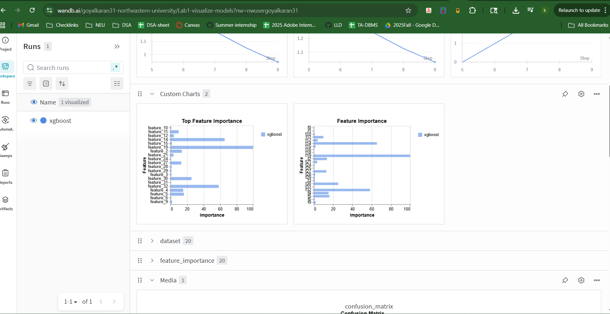

# Lab 1 - XGBoost Model Training with Wandb

This project refactors the original Jupyter notebook (`Lab1.ipynb`) into a modular Python package for training an XGBoost classifier on the Dermatology dataset with Wandb integration for experiment tracking.

## Project Structure

```
.
├── main.py              # Main entry point
├── config.py            # Configuration parameters
├── data_loader.py       # Data downloading and preprocessing
├── model_trainer.py     # Model training and evaluation
├── requirements.txt     # Python dependencies
├── .gitignore          # Git ignore file
├── Lab1.ipynb          # Original notebook
└── README.md           # This file
```

## Installation

### Step 1: Create Virtual Environment

```bash
# Windows
python -m venv .venv
.\.venv\Scripts\Activate

# Linux/macOS
python3 -m venv .venv
source .venv/bin/activate
```

### Step 2: Install Dependencies

```bash
pip install -r requirements.txt
```

## Usage

### Running the Training Pipeline

Make sure your virtual environment is activated, then run:

```bash
python main.py
```

This will:
1. Login to Wandb (you'll be prompted for credentials)
2. Initialize Wandb run with tags and notes
3. Log system information (platform, Python version, CPU, memory)
4. Download the Dermatology dataset from UCI if not already present
5. Log dataset as Wandb artifact
6. Load and preprocess the data
7. Log dataset statistics and visualizations (class distributions, sample data)
8. Train an XGBoost model with the configured parameters
9. Evaluate the model and log comprehensive metrics (accuracy, precision, recall, F1)
10. Generate visualizations (confusion matrix, feature importance, classification report)
11. Save and log the trained model as a Wandb artifact
12. Send training completion alert

### Configuration

All model and training parameters can be modified in `config.py`:

- **Model Parameters**: `MODEL_PARAMS` (objective, eta, max_depth, etc.)
- **Training Parameters**: `NUM_ROUNDS`, `TRAIN_SPLIT`
- **Wandb Settings**: `WANDB_PROJECT`, `WANDB_RUN_NAME`

## Module Descriptions

### `main.py`
Main entry point that orchestrates the entire training pipeline. Handles Wandb initialization, system info logging, dataset artifact logging, and cleanup.

### `config.py`
Centralized configuration file containing all hyperparameters, dataset URLs, and project settings.

### `data_loader.py`
- `download_dataset()`: Downloads the dataset from UCI if it doesn't exist locally
- `load_data()`: Loads and preprocesses the data, splits into train/test sets, and creates XGBoost DMatrix objects
- `log_dataset_statistics()`: Logs dataset statistics, class distributions, and sample data to Wandb

### `model_trainer.py`
- `train_model()`: Trains the XGBoost model with Wandb logging
- `evaluate_model()`: Comprehensive model evaluation with multiple metrics and visualizations
- `log_feature_importance()`: Logs and visualizes top feature importances
- `log_model_artifact()`: Saves and logs the trained model as a Wandb artifact

## Dataset

The project uses the [Dermatology Dataset](https://archive.ics.uci.edu/ml/datasets/dermatology) from UCI Machine Learning Repository. The dataset is automatically downloaded on first run.

## Wandb Integration

The project includes comprehensive Wandb integration for experiment tracking and visualization:

### Metrics & Logging
- **Model Hyperparameters**: All model parameters logged to Wandb config
- **Training Metrics**: Automatic logging via XGBoost callback (train/test loss per iteration)
- **Evaluation Metrics**: Accuracy, Precision, Recall, F1-Score, and Error Rate
- **Classification Report**: Per-class metrics logged as interactive table

### Visualizations
- **Confusion Matrix**: Multi-class confusion matrix visualization
- **Class Distribution**: Bar charts showing train/test class distributions
- **Feature Importance**: Top 20 features visualized as bar chart
- **Data Samples**: Sample training data logged as interactive table

### Artifacts
- **Model Artifact**: Trained XGBoost model saved and logged as Wandb artifact
- **Dataset Artifact**: Original dataset file logged as artifact for reproducibility

### System & Metadata
- **System Information**: Platform, Python version, CPU count, memory usage
- **Run Tags**: Automatic tagging (xgboost, dermatology, classification)
- **Run Notes**: Descriptive notes for each run
- **Alerts**: Training completion alerts

### Dataset Statistics
- Dataset sizes (train/test/total)
- Number of features and classes
- Class distribution counts for train and test sets
- Class distribution visualizations

### Wandb Screenshots



.png)

.png)

Make sure you have a Wandb account and are logged in before running the script.

## Requirements

- Python 3.7+
- wandb >= 0.15.0
- numpy >= 1.24.0
- xgboost >= 2.0.0
- pandas >= 2.0.0
- scikit-learn >= 1.3.0
- matplotlib >= 3.7.0
- psutil >= 5.9.0

